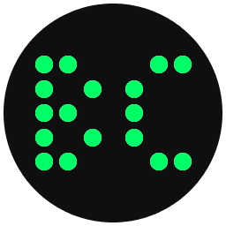

# Braille-Core
Convert Images or Pixel Art to Braille Unicode

⠀⣠⣤⣤⣤⣄⠀⠀⢀⣀⡀⠀⠀⠀⠀⠀⢀⡀⠀⠀⣠⣤⣤⣤⣄⠀⠀⣴⣦⠀⣴⣦⠀

⢰⣿⠋⠉⠉⢻⣷⠀⣿⡟⢿⣷⡀⢠⣾⠿⢿⣦⠀⠙⢻⣿⠋⠁⠀⣿⣿⠀⣿⣿⠀⠀

⢸⣿⠀⠀⣀⣾⡟⢰⣿⠃⠀⢿⣧⢸⣿⠀⠈⣿⡇⠀⠀⢸⣿⠀⠀⠀⣿⣿⠀⣿⣿⠀⠀

⢸⣿⢿⣿⣿⡋⠀⢸⣿⣶⣶⡿⠋⢸⣿⣶⣶⣿⡇⠀⢸⣿⠀⠀⠀⠀⣿⣿⠀⣿⣿⠀

⢸⣿⠀⠀⢹⣿⡄⢸⣿⠉⢻⣷⡀⢸⣿⠀⠀⣿⡇⠀⠀⢸⣿⠀⠀⠀⣿⣿⠀⣿⣿⠀⠀

⠸⣿⣤⣤⣼⡿⠀⢸⣿⠀⠀⢻⣷⢸⣿⠀⠀⠀⣿⡇⠀⢸⣿⠀⠀⠀⣿⣿⠀⠀⣿⣿⠀

⠀⠈⠉⠉⣉⣀⣀⣀⠁⠀⠀⠘⠟⠘⠟⠀⠀⠀⢿⠇⢴⣾⣿⣶⠄⠀⣿⣿⠀⣿⣿⠀

⠀⠀⢠⣾⠟⠛⠛⠻⢿⣦⠀⠀⠀⠀⢀⣤⣤⡀⠀⠀⠀⠈⠉⠁⠀⠀⠀⠈⠁⠀⠈⠁⣀

⠀⢠⣿⠇⠀⠀⠀⠀⠀⠀⠁⠀⠀⣰⣿⠋⠙⣿⡆⠀⠀⠀⢀⣴⣶⣿⣦⡠⣶⣶⡿⠿⠟

⠀⢸⣿⠀⠀⠀⠀⠀⠀⠀⠀⠀⠀⠀⣿⡇⠀⠀⢹⣿⡀⢠⣿⠏⠀⠀⣿⡇⣿⡇⠀⠀⠀⠀

⠀⢸⣿⠀⠀⠀⠀⠀⠀⠀⠀⠀⢰⣿⠃⠀⠀⠀⠀⣿⡇⢸⣿⣤⣴⣾⠟⠁⣿⡇⠀⣀⣤

⠀⢸⣿⡀⠀⠀⠀⠀⠀⠀⠀⠀⠸⣿⡄⠀⠀⠀⠀⣿⡇⢸⣿⣿⡉⠀⠀⠀⣿⣿⠿⠟⠋

⠀⠀⢿⣧⠀⠀⠀⠀⠀⠀⣾⡆⠀⢿⣧⡀⠀⢀⣿⡇⢸⣿⠻⣷⡄⠀⠀⠀⢸⣿⠀⠀⠀

⠀⠀⠘⢿⣦⣤⣄⣤⣼⡿⠁⠀⠀⠻⢿⣶⣾⠟⠀⠀⢸⣿⠀⠙⢿⣦⡀⢸⣿⣀⣀⣤

⠀⠀⠀⠀⠉⠉⠛⠋⠉⠀⠀⠀⠀⠀⠀⠀⠀⠀⠀⠀⠀⠀⠀⠁⠀⠀⠀⠙⠁⠈⠛⠛⠛⠋

